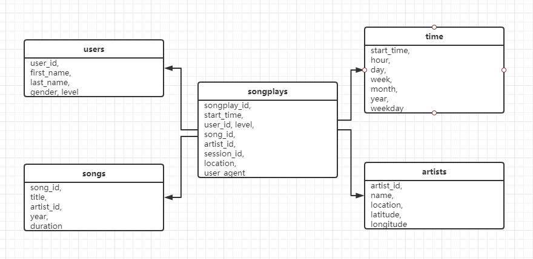

### Introduction

A startup called Sparkify wants to analyze the data they've been collecting on songs and user activity on their new music streaming app. The analytics team is particularly interested in understanding what songs users are listening to and need an efficient way to query the data.

This project intend to create a proper Postgres database and ETL pipeline for Sparkift's analysis .


#### Database schema




#### ETL process

Extract data from original json file into pandas DataFrame

--->Slice and transform data to fit table structure

--->Insert Data to table by SQL query


####  File structure

1. `test.ipynb` displays the first few rows of each table to let you check your database.
2. `create_tables.py` drops and creates tables.  Run this file to reset tables before each time you run your ETL scripts.
3. `etl.ipynb` reads and processes a single file from `song_data` and `log_data` and loads the data into your tables. This notebook contains detailed instructions on the ETL process for each of the tables.
4. `etl.py` reads and processes files from `song_data` and `log_data` and loads them into tables. 
5. `sql_queries.py` contains all sql queries, and is imported into the last three files above.
6. Data directory contains song_data and log_data


#### How to use

drop and create tables

```
python create_tables.py
```

process data and insert it to database

```
python etl.py
```